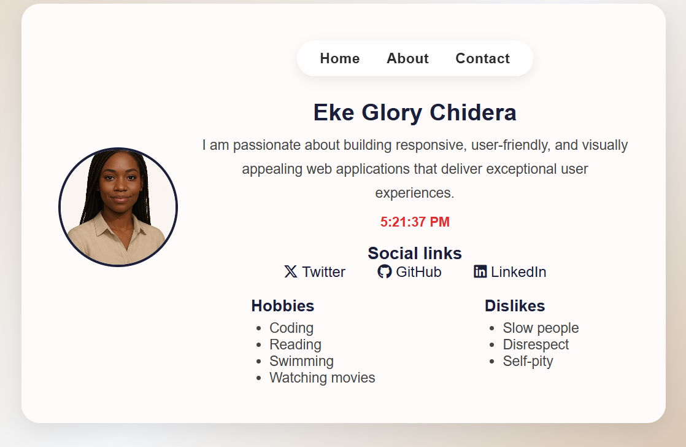
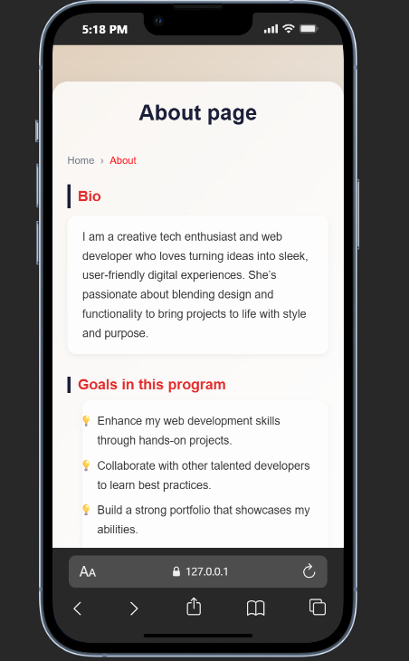
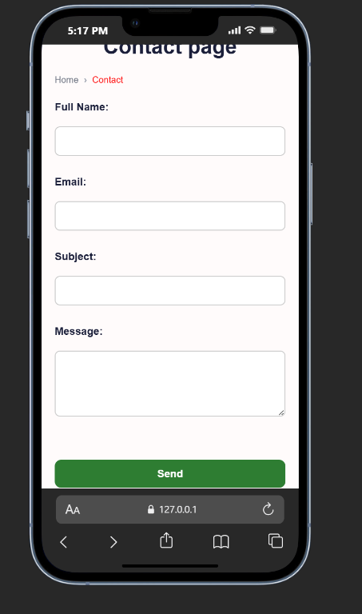

🌟 HNG Frontend Wizards — Stage 0: Multi-Page Profile Website

This is my submission for the HNG Internship 2025 (Frontend Wizards Track) — Stage 0 Task: Profile Card and extended pages (About & Contact).
It’s a multi-page, accessible, and responsive website built using only HTML, CSS, and Vanilla JavaScript, following semantic and data-testid guidelines.

🧭 Table of Contents

📜 Task Description

🧱 Built With

⚙️ Features

🧾 Data Test IDs

🕒 JavaScript Logic

🎨 Screenshots

🚀 Live Demo & Repository

🧭 How to Run Locally

👨‍💻 Author

🏁 Submission

📜 Task Description

The project includes:

👤 A Profile Page displaying key user info (name, avatar, hobbies, dislikes, social links).

🧍‍♀️ An About Page describing the user’s bio, goals, and experience.

📩 A Contact Page with a working form simulation (error/success messages and field validation).

All pages use semantic HTML, accessible labels, and data-testid attributes for testing consistency.

🧱 Built With

HTML5 — semantic structure and accessibility

CSS3 — layout, styling, and responsiveness (Flexbox + media queries)

JavaScript (ES6) — interactive behavior, validation, and dynamic time updates

Font Awesome — for professional icons

Breadcrumb navigation — for improved UX

⚙️ Features
🏠 Profile Page

✅ Displays name, bio, hobbies, dislikes, avatar
✅ Live time display using Date.now() (updates every second)
✅ Social links to Twitter, GitHub, and LinkedIn
✅ Fully responsive and keyboard accessible

👩‍💼 About Page

✅ Structured layout describing user’s background, experience, and skills
✅ Uses proper headings and semantic sections
✅ Styled breadcrumb navigation for page context
✅ Fully responsive design and accessible typography

✉️ Contact Page

✅ Accessible contact form with proper <label> + for attributes
✅ Validation for:

All fields required

Valid email format

Message minimum of 10 characters
✅ Inline error and success feedback (ARIA compliant)
✅ Prevents page reload and simulates success/failure
✅ Keyboard navigable and screen-reader friendly

🧾 Data Test IDs
🏠 Profile Page
Element	data-testid
Profile card container	test-profile-card
User name	test-user-name
User bio	test-user-bio
Current time	test-user-time
Avatar image	test-user-avatar
Social links container	test-user-social-links
Twitter link	test-user-social-twitter
GitHub link	test-user-social-github
LinkedIn link	test-user-social-linkedin
Hobbies list	test-user-hobbies
Dislikes list	test-user-dislikes

👩‍💼 About Page
Element	data-testid
About page container	test-about-page
About title	test-about-title
About content section	test-about-content
Skills list	test-about-skills
Breadcrumb navigation	test-breadcrumb

✉️ Contact Page
Element	data-testid
Contact page container	test-contact-page
Contact form	test-contact-form
Full Name label/input	test-contact-name
Email label/input	test-contact-email
Subject label/input	test-contact-subject
Message textarea	test-contact-message
Submit button	test-contact-submit

🕒 JavaScript Logic
🧭 Live Time
function updateTime() {
  const currentTime = Date.now();
  document.querySelector('[data-testid="test-user-time"]').textContent = currentTime;
}
updateTime();
setInterval(updateTime, 1000);

📩 Form Validation
form.addEventListener("submit", (e) => {
  e.preventDefault();

  if (!form.checkValidity()) {
    message.textContent = "⚠️ Please fill in all fields correctly.";
    message.className = "form-message error";
    return;
  }

  const isSuccess = Math.random() > 0.3;
  message.textContent = isSuccess
    ? "✅ Message sent successfully!"
    : "❌ Something went wrong. Try again.";
  message.className = isSuccess ? "form-message success" : "form-message error";

  if (isSuccess) form.reset();

  setTimeout(() => {
    message.textContent = "";
    message.className = "form-message";
  }, 4000);
});

🎨 Screenshots

### 🏠 Profile Page
Displays the user’s profile card with live time and social links.  

---

### 👩‍💼 About Page
Contains personal background and skills, with breadcrumb navigation.  

---

### ✉️ Contact Page
Accessible form with validation and dynamic success/error messages.  

Profile Page — profile details and time

About Page — structured content and breadcrumbs

Contact Page — accessible form and messages

🚀 Live Demo & Repository

🌐 Live URL:

https://lorydera.github.io/my-profile-card/

💾 GitHub Repository:

https://github.com/Lorydera/my-profile-card

🧭 How to Run Locally
# Clone repository
git clone https://github.com/Lorydera/my-profile-card.git

# Open folder
cd my-profile-card

# Launch index.html in your browser

👨‍💻 Author

Eke Glory Chidera
Frontend Developer

🌐 LinkedIn

💻 GitHub

🔗 Twitter

🏁 Submission

This project fulfills all HNG Stage 0 requirements and extends them with:

Multi-page structure (index.html, about.html, contact.html)

Valid and accessible markup

Complete data-testid coverage

Responsive design with consistent styling

JavaScript-based form validation and real-time updates

Built with clean code, accessibility, and creativity ✨