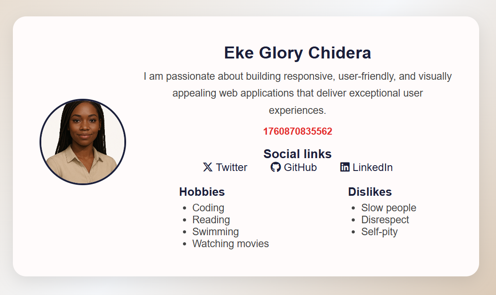

# 🌟 HNG Frontend Wizards — Stage 0: Profile Card


This is my submission for the **HNG Internship 2025 (Frontend Wizards Track)** — **Stage 0 Task: Profile Card**.  
The challenge was to build a **responsive, accessible, and testable Profile Card** using only **HTML, CSS, and Vanilla JavaScript**, following semantic and `data-testid` guidelines.

---

## 🧭 Table of Contents
- [📜 Task Description](#-task-description)
- [🧱 Built With](#-built-with)
- [⚙️ Features](#️-features)
- [🧾 Data Test IDs](#-data-test-ids)
- [🕒 JavaScript Logic (Time)](#-javascript-logic-time)
- [🎨 Screenshots](#-screenshots)
- [🚀 Live Demo & Repository](#-live-demo--repository)
- [🧭 How to Run Locally](#-how-to-run-locally)
- [👨‍💻 Author](#-author)
- [🏁 Submission](#-submission)


---

## 📜 Task Description

The **Profile Card** displays:
- 👤 Name  
- ✍️ Short biography  
- 🕒 Current time (in milliseconds) using `Date.now()`  
- 🖼️ Avatar image  
- 🔗 Social media links (Twitter, GitHub, LinkedIn)  
- 💡 Hobbies  
- 🚫 Dislikes  

All elements include specific `data-testid` attributes for automated testing.

---

## 🧱 Built With

- **HTML5** — for semantic structure and accessibility  
- **CSS3** — for layout, styling, and responsiveness (Flexbox + media queries)  
- **JavaScript (ES6)** — to dynamically display real-time milliseconds  
- **Font Awesome** — for professional social media icons  

---

## ⚙️ Features

✅ Semantic and accessible HTML structure  
✅ Fully responsive layout (mobile → tablet → desktop)  
✅ Real-time milliseconds clock that updates every second  
✅ Clean, modern card design with soft hover animation  
✅ Social links open in new tabs with secure `rel` attributes  
✅ Keyboard-navigable and screen-reader friendly  

---

## 🧾 Data Test IDs (for HNG Automated Tests)

| Element | data-testid |
|----------|--------------|
| Profile card container | `test-profile-card` |
| User name | `test-user-name` |
| User bio | `test-user-bio` |
| Current time | `test-user-time` |
| Avatar image | `test-user-avatar` |
| Social links container | `test-user-social-links` |
| Twitter link | `test-user-social-twitter` |
| GitHub link | `test-user-social-github` |
| LinkedIn link | `test-user-social-linkedin` |
| Hobbies list | `test-user-hobbies` |
| Dislikes list | `test-user-dislikes` |

---

## 🕒 JavaScript Logic (Time)

```js
function updateTime() {
  const currentTime = Date.now(); // current time in milliseconds
  document.querySelector('[data-testid="test-user-time"]').textContent = currentTime;
}
updateTime();
setInterval(updateTime, 1000);
```

- ✔️ Uses `Date.now()` exactly as required.
- ✔️ Updates automatically every second for live accuracy.

---



## 🚀 Live Demo & Repository

🌐 Live URL: 
```
https://github.com/Lorydera/my-profile-card/

```

💾 GitHub Repo: 
```
https://github.com/Lorydera/my-profile-card

```
---

## 🧭 How to Run Locally
1. Clone this repository:

```
bash

git https://github.com/Lorydera/my-profile-card.git
```
2. Open the folder:
```
bash

cd profile-card
```
Launch `index.html` in your browser.

---

## 👨‍💻 Author
Eke Glory Chidera
Frontend Developer

- 🌐 [LinkedIn](www.linkedin.com/in/ekeglorychidera)
- 💻 [GitHub](https://github.com/Lorydera))
- 🔗 [Twitter](https://x.com/_lorydera?s=21))

---


## 🏁 Submission
This project fulfills all **HNG Stage 0 requirements**, including:

- Correct `data-testid` attributes

- Semantic and accessible HTML structure

- Responsive, testable layout

- Accurate `Date.now()` time implementation

```
Built with clean code, creativity, and attention to detail. ✨
```
